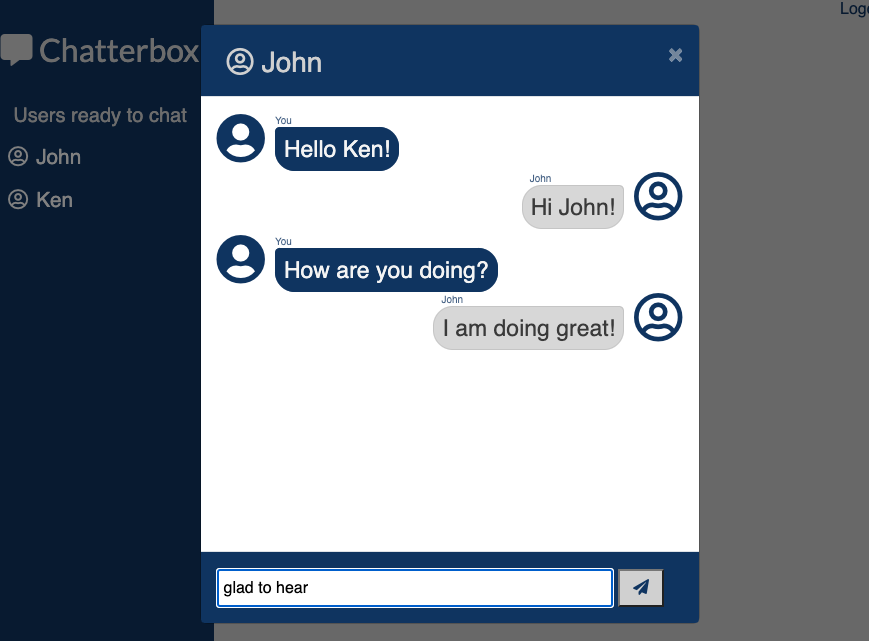

# ChatterBox

## Description

Chatterbox is a responsive web application that allows you to chat online with a friend. You will experience modern design with traditional chat functionality!

## Table of Contents

* [Description](#description)
* [Technology](#technology)
* [User Story](#user-story)
* [Installation](#installation)
* [Usage](#usage)
* [License](#license)
* [Contributing](#contributing)
* [Tests](#tests)
* [Questions](#questions)
* [Deployed Application URL](#deployed-application-URL)

## Technology

- REACT
- Redux
- Socket.io
- HTML
- CSS
- Boostrap
- Javascript

## User Story

As a social butterfly,
I WANT to be able to chat with my friend online.

## Installation

No installation needed

## Usage

The deployed application link will take you to the homepage. On the homepage, type in your name. This name will be displayed to the other online users. Click on a logged in user to pull up a chat box. Type in you message and start chatting with a friend. 

## License

## Contributing

Please follow standard contributing guidelines.

## Tests

No tests to run.

## Questions

For any questions, please contact kendayao at kendayao@gmail.com

## Deployed Application URL

Deployed application link: 

Video demo link: 

